# LAB 05: Power BI

In this lab, you will build a Power BI dashboard that visualizes data about problems reported by company employees.

## What you will learn

  - How to connect to Dataverse 
  - How to refine the data model and prepare it for reporting
  - How to create a Power BI visualization 
  - How to embed a Power BI report in Microsoft Teams

## High-level lab steps

We will follow the below steps to design and create the Power BI dashboard:

-   Connect to tables in Microsoft Dataverse 
-   Transform the data to include user-friendly descriptions for the related Rows (lookups)
-    Create and publish a report with various visualizations of the information about problem reports
-    User natural language query to build additional visualizations
-    Build mobile view
-    Embed the Company 311 Power BI report to Microsoft Teams

## Prerequisites

* Must have completed **Lab 02.1: Data model and model-driven app**
* Permissions to install programs on your computer (required for Power BI Desktop installation)

## Things to consider before you begin

-   Who is the target audience of the report?
-   How will the audience consume the report? Typical device? Location?
-   Do you have sufficient data to visualize?
-   What are the possible characteristics you can use to analyze data about the visits?

## Detailed steps

### Exercise 1: Prepare environment & data  

**Objective:** In this exercise, you will install and configure Power BI Desktop and configure a connection to Microsoft Dataverse. 

> [!IMPORTANT]
> If you do not have required permissions to install desktop applications or experience difficulties in configuring Power BI Desktop and connecting it to the data, follow **Addendum: Import sample data** and then continue on **Exercise 2** but using Power BI service instead of Power BI Desktop.

#### Task 1: Configure Power BI Desktop

1. If you do not have Power BI Desktop installed, navigate to [https://aka.ms/pbidesktopstore](https://aka.ms/pbidesktopstore) to download and install Power BI app.

   > [!IMPORTANT]
   > If you experience issues installing Power BI Desktop using Microsoft Store, try standalone installer that can be downloaded from [https://aka.ms/pbiSingleInstaller](https://aka.ms/pbiSingleInstaller).

1. Open Power BI Desktop.

1. If you signed in into Power BI Desktop previously, select **File | Sign out** 

1. Sign in if prompted or select **File | Sign in** to sign in.  

1. If you're signing in for the first time you may receive the following prompt

      

1. Select **Sign up for Power BI** and follow the prompts to complete the sign up 

#### Task 2: Prepare Data

1.  Find out your organization URL

    * Navigate to [Power Platform Admin Center](https://aka.ms/ppac).
    * In the left navigation page, select Environments, and then click on the target environment.
    * Right mouse click **Environment URL** on the **Details** panel, then select **Copy link**.

      

1. Switch to Power BI desktop.

1. Select **Get data | More...**

      

1. Select **Power Platform**, then select **Dataverse** and press **Connect**.

      

1. Paste the environment URL you copied earlier without the https://, select **DirectQuery**, and click **OK**.

      

1. The connection details dialog will open up. If you are not signed in, click **Sign in** and follow the prompts to sign in. Press **Connect**. 

1. Expand environment node, select **lh_Building**, **lh_Department**, **lh_ProblemReport** tables and select **Load**. Wait until the load is complete.

      

1. Click **Model** icon on the left vertical toolbar.

      

1. Power BI should detect the relationship between the table. The relationship should look like the image below.

      

1.  Select **Report** icon on the left toolbar.

      

1. Expand **lh_ProblemReports** node in the **Fields** panel.

1. Click on the **...** More options button of the **lh_ProblemReports** table.

      

1. Select **New column**.

      

1. Complete the formula as below and press ENTER or click checkmark button. That will add a new column with the building name into the problem report data.

        ```Building = RELATED(lh_Building[lh_name])```

      

1. Repeat the three previous steps on **lh_problemreports** node to add a column **Department** with the below formula.

        ```Department = RELATED(lh_Department[lh_name])```

1.  Click ... next on the **lh_problemreportid** column of the **lh_problemreport** table and select **Rename**. Enter **Problem Report** as the column name.

1.  Click ... next on the **statuscodename** column and select **Rename**. Enter **Status** as the column name.

1.  Save work in progress by pressing **File &#124; Save** and enter **Problem management** as a filename.

### Exercise 2: Create Power BI Report 

**Objective:** In this exercise, you will create a Power BI report based on data from Microsoft Dataverse tables.

#### Task 1: Create Chart and Time Visualizations

1. Click on **Pie chart** icon in the **Visualizations** panel to insert the chart.

      

1. Drag **Building** Column and drop it into **Legend** target box.

1. Drag **Problem Report** Column and drop it into **Values** target box.

      

1. Resize the pie chart using corner handles so that all chart components are visible. Your report should now look like this:

      

1. Click **New visual** on the Power BI ribbon then select **stacked column** chart in **Visualizations** pane. 

      

1. Drag **Problem Report** Column and drop it into **Values** target box.

1. Drag **Status** Column and drop it into **Axis** target box.

1. Resize the chart as required using the corner handles.

1. Test the report interactivity:

    * Select various building slices on the pie chart and observe changes on the stacked column chart.
    * Select various bars on the stacked column chart and observe changes on the pie report.

      

1. Select the **Insert**, and click **Q&A**.

      

1.  Select **Turn on Q&A** and wait for the Q&A to get ready.

1.  Type **bar count of problem reports by building** and hit enter. You should see a bar chart.

      

1.  The dashboard now has Q&A enabled. Click on the **...** More options button of the Q&A visual and click **Remove**.

      

1.  Save work in progress by selecting **File | Save**.


### Exercise 3: Create Power BI Dashboard

#### Task 1: Publish Power BI Report

1. Navigate to [Power BI Service](https://app.powerbi.com)

1. Select **Workspaces** and click **Create a workspace**.

      

1. Enter **311 Workspace** for Workspace name and click **Save**.

1. Go back to the Power BI desktop application, select the **Home** tab, and click **Publish** .

      

1. Select **311 Workspace** as the destination, then click **Select**.

1. Wait until publishing is complete and click **Open \<name of your report\>.pbix in Power BI**.

      

This will open the published report in the browser.

> [!NOTE]
> If you are getting an error on PowerBI Service with message "the data source is missing credentials and cannot be accessed", follow the below steps:
>
> 1. Select 311 Workspace and select Problem Management dataset.
> 2. Expand Refresh dropdown and select Schedule refresh.
> 3. Expand Data Source credentials section and select Edit Credentials.
> 4. Select OAuth2 for Authentication Method and Organizational for Privacy level setting.
> 5. Select Sign In. This will resolve the issue for report and it should display properly on Power BI Service.

#### Task 2: Create Power BI Dashboard

1. Expand **311 Workspace**.

1. Select the **Problem management** report under **Reports** heading.

      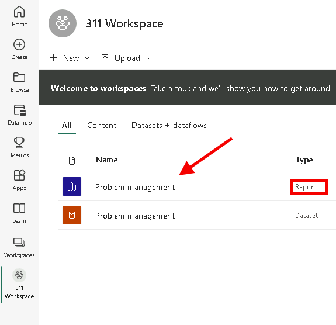

1. Select **Pin to a dashboard** on the menu. Depending on the layout you may need to press **...** to show additional menu items.

      

1. Select **New dashboard** on **Pin to dashboard** prompt.

1. Enter **Problem Management Dashboard** as a **Dashboard name**, select **Pin live**.

      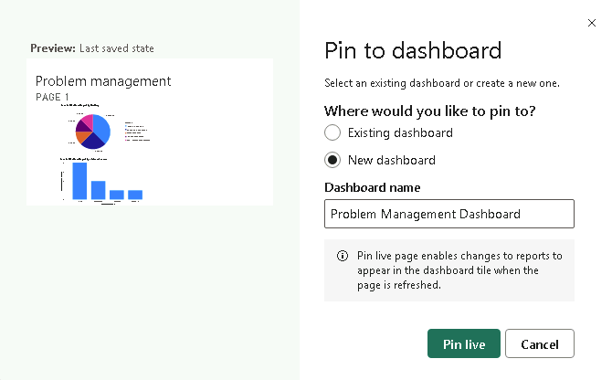

1. Select **311 Workspace** node, select **Problem Management Dashboard**.

1. Test interactivity of the pie and bar charts that are displayed.

#### Task 3: Add Visualizations Using Natural Language

1. Select **Ask a question about your data** on top of the dashboard.

      

1. Enter **funnel count of problem reports by status** in Q&A area. The funnel chart will be displayed.

1. Select **Pin visual**.

      

1. Select **Existing dashboard**, select **Problem Management dashboard**, select **Pin**.

#### Task 4: Build Mobile Phone View

1. Select the **Problem Management dashboard** from **Dashboards** area.

1. Click **Edit** and then select **Mobile layout** from the drop down box.

1. Rearrange tiles as desired.

      

1. Select your report under **311 Workspace | Reports**

1. Select **File** and then select **Generate QR Code** from the drop down box.

      

1. If you have a mobile device, scan the code using a QR scanner app available on both iOS and Android platforms.

   > [!NOTE]
   > To access the dashboard and report you will have to sign in on the phone as the same user.

1. Navigate and explore reports and dashboards on a mobile device. 

### Exercise 4: Embed Power BI report

In this exercise, you will add the Company 311 Power BI report to Microsoft Teams and to the Company 311 Admin Model-driven application as a way for management and staff to be able to view the reports from directly within Teams and the Model-driven application. 

#### Task 1: Setup Company 311 Team

In this task you will setup a Microsoft Teams team for the Lamna Healthcare Company, if you have not done so previously.

1.  Navigate to [Microsoft Teams](https://teams.microsoft.com) and sign in with the credentials you have been using previously.

1.  Select **Use the web app instead** on the welcome screen.

      

1.  When the Microsoft Teams window opens, dismiss the welcome messages.

1.  On the bottom left corner, choose **Join or create a team**.

1.  Select **Create a team**.

      

1.  Press **From scratch**.

1.  Select **Public**.

1.  For the Team name choose **Company 311** and select **Create**.

1.  Select **Skip** adding members to Company 311.


#### Task 2: Embed Power BI report to Teams

1.  Navigate to [Microsoft Teams](https://teams.microsoft.com).

1.  Select the **General** channel of the **Company 311** team.

1.  On the top of the page, press the **+** symbol to add a new tab.

      

1.  Search for **power** and select **Power BI** from the results.

1.  Expand **311 Workspace** and select the report you created earlier in this lab and click **Save**.

      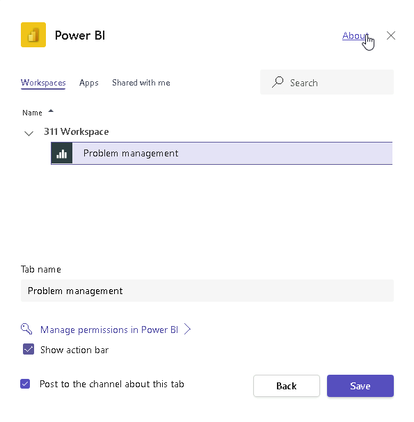

1.  You should now see your Power BI report in a tab in Microsoft Teams

      


#### Task 3: Embed Power BI report to Model-driven app

1. Navigate to [Power BI](https://app.powerbi.com/home).

1. Click to select **Datasets**.

      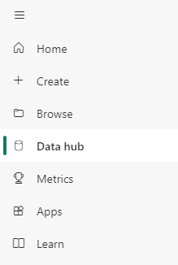

1. Hover over the dataset you created, click on the **...** More options button, and select **Settings**.

      

1. Click **Edit credentials**  located in the Data source credentials section.

1. Select **OAuth2** for Authentication method, select **Organizational** for Privacy level setting, and click **Sign in**.

      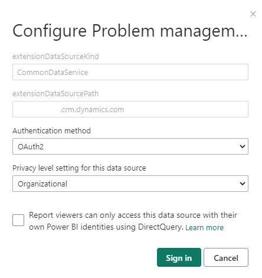

1. Provide your credentials.

1. Navigate to [Power Apps maker portal](https://make.powerapps.com/) and make sure you are in your practice environment.

1. Select **Solutions** and click to open the **Company 311** solution.

1. Click **+ New** and select **Dashboard | Power BI embedded**.

      

1.  Enter **Problem management** for Display name, select **Power BI report** for type, select **311 Workspace** for Power BI workspace, select **Problem management** for Power BI report and click **Save**.

      

1.  Click **Publish all customizations** and wait for the publishing to complete.

1.  While still in the Company 311 solution, click to open the the **Company 311 Admin** Model-driven application.

      

1.  Click on the **Edit** icon of the Sitemap.

      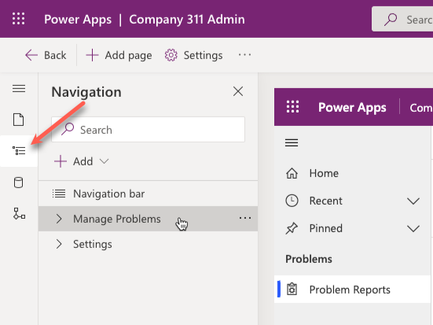

1.  Click **+ Add** and select **Group**.

      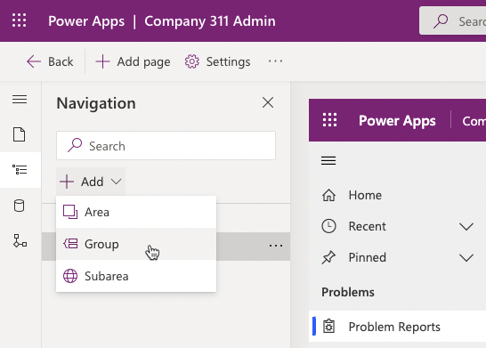

1.  Go to the **Properties** pane and enter **Reports** for Title.

1.  Select the **Reports** group you just created, click **+ Add** and select **Subarea**.

      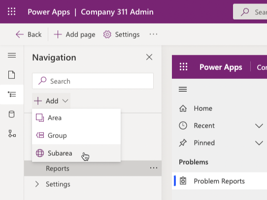

1.   Go to the **Properties** pane, select **Dashboard** for Type, select **Problem management** for Default dashboard, and enter **Problem report** for Title.

      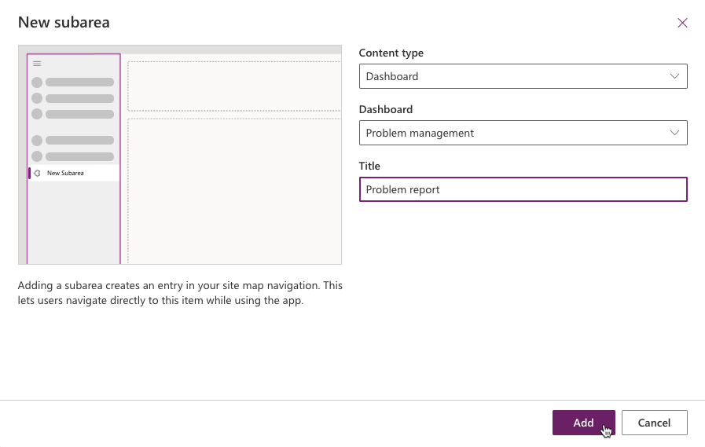

1.  Drag the new **Reports** group and drop it before the **Problems** group.

1.  The groups in the **Manage Problems** area should now look like the image below.

      

1.  Click **Save and Close** to close the sitemap editor.

1.  Click **Save and Close** again to close the app designer.

1.  Click **Done**.

1.  Click **Publish all customizations** and wait for the publishing to complete.

1.  Select **Apps** and click to launch the **Company 311 Admin** Model-driven application.

1.  The report should load.

      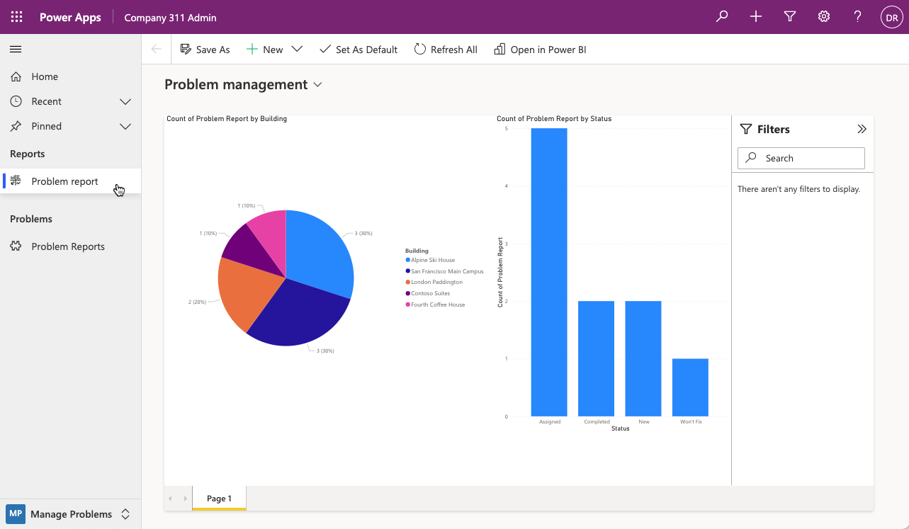

1.  Interact with report and make sure it behaves as expected.

### Exercise 5: Power BI embedded canvas

In this exercise, you will add embedded canvas application to Power BI as a visual.


#### Task 1: Add canvas

1. Navigate to [Power BI](https://app.powerbi.com).

1. Select **Workspaces** and then select to open **311 Workspace**.

1. Click to open the **Problem management** report.

1. Click **Edit**.

1. Resize and reposition the visuals as shown below.

     

1. Click on an empty area of the canvas, go to the **Visualizations** and click **Power Apps for Power BI**.

     

1. Select the Power BI visual you just created, expand the **lh_problemreport** table select **Problem Report** column.

      

1. Select your practice environment and click **Create new**.

      

1. A new browser window or tab should open and load the app studio.

1. Do not navigate away from this page.

#### Task 2: Customize the app

1.  Right click on **Gallery** and select **Delete**.

      

1.  Click **File**.

1.  Select **Settings**.

1.  Select **Display**.

1.  Change the **Orientation** for **Landscape**.

1.  Click **Apply** on the popup.

1.  Close the **Settings** window.

1.  Select **Data** and click **Add data**.

        

1.  Select the **Problem reports** table.

      

1.  Select the **App** object from the Tree view.

1.  Select the **OnStart** of the **App** object and set it to the formula below. This formula will create two variables one to keep track of the current index of the reports table and another to keep track of the current item row.

      ```Set(currentIndex,1);Set(CurrentItem, LookUp('Problem Reports', 'Problem Report' = GUID(Last(FirstN([@PowerBIIntegration].Data,currentIndex)).'Problem Report')))```

      

1.   Select the **Insert** tab, click **Media**, and select **Image**.

        

1.  Set the **Image** value to the formula below.

      ```CurrentItem.Photo```

1.  Click on the **...** button of the **App** object and select **Run OnStart**.

      

1.   You should see the photo. If you are not seeing the photo, then go to your Model Driven App and add photo to Problem Reports records where the Photo field is empty.

      

1.  Set the **X** value of the image to **0**.

1.  Set the **Y** value of the image to **0**.

1.  Set the **Width** value of the image to the formula below.

      ```Parent.Width```

1. Set the **Height** value of the image to the formula below.

      ```Parent.Height```

1.  The image should fill the screen.

      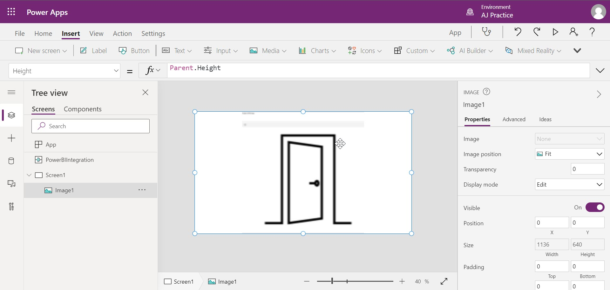

1.  Do not navigate away from this page.


#### Task 3: Add controls

1.  Select the **Insert** tab and click **Label**.

1.  Select the label you just added and set the **Text** value to the formula below.

      ```CurrentItem.Title```

1.  Set the **Height** value of the labe to **60**.

1.  Set the **X** value of the label to **0**.

1.  Set the **Y** value of the label to formula below.

      ```Parent.Height -Self.Height```

1.  Set the the **Width** value of the label to formula below.

      ```Parent.Width```

1.  Set the **Fill** value of the label to **RGBA(0, 108, 191, .5)**.

1.  Set the **Color** value of the label to **RGBA(255, 255, 255, 1)**.

1.  Set the **Align** value to the formula below.

      ```Align.Center```

1. The label should now look like the image below. If you don't see the title, click on the **...** button of the **App** object and **Run OnStart** again.

      

1.  Go to the **Insert** tab, click **Icons** and select **Next**.

1.  Double click on the icon you just added and rename it **Next icon**.

1.  Go to the **Insert** tab, click **Icons** and select **Back**.

1.  Double click on the second icon you just added and rename it **Back icon**.

1.  Drag and place the the **Next icon** above the right side of the label.

1.  Drag and place the the **Back icon** above the left side of the label.

1.  The icons should now look like the image below.

      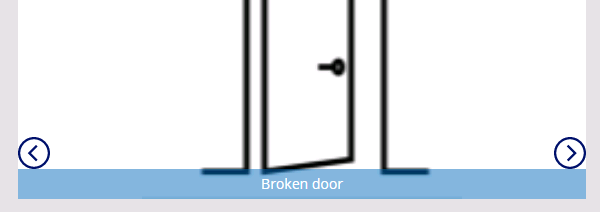

1.  Select the **Next icon** and set the **OnSelect** value to the formula below.

      ```UpdateContext({CurrentItem: LookUp('Problem Reports', 'Problem Report' = GUID(Last(FirstN([@PowerBIIntegration].Data,currentIndex)).'Problem Report'))});UpdateContext({currentIndex: currentIndex +1})```

1.  Set the **DisplayMode** value of the **Next icon** to the formula below.

      ```If(currentIndex = CountRows([@PowerBIIntegration].Data), DisplayMode.Disabled, DisplayMode.Edit)```

1.  Select the **Back icon** and set the **OnSelect** value to the formula below.

      ```UpdateContext({CurrentItem: LookUp('Problem Reports', 'Problem Report' = GUID(Last(FirstN([@PowerBIIntegration].Data,currentIndex)).'Problem Report'))});UpdateContext({currentIndex: currentIndex -1})```

1.   Set the **DisplayMode** value of the **Back icon** to the formula below.

      ```If(currentIndex > 1, DisplayMode.Edit, DisplayMode.Disabled)```

1.   Go to the **Insert** tab, click **Icons** and select **Check**.

1.   Rename the Check icon **Complete icon**.

1.   Move the **Complete icon** to the top right of the screen.

1.   Set the OnSelect of the **Check icon** to the formula below. This formula will update the status of the row to completed and then refresh Power BI.

      ```Patch('Problem Reports', CurrentItem, {'Status Reason': 'Status Reason (Problem Reports)'.Completed}); PowerBIIntegration.Refresh()```

1.   Click **Play**.

1.   Click on the next and back icons and make sure the image changes.

1.   Close the preview.

1.   Click **File**.

1.   Click **Save**.

1.   Select **Cloud** enter **Power BI embed app**.

1.   Click **Save**.

1.   Close the app studio browser window or tab.

1.   You should now be back on the Power BI report. Click **Refresh** on the top header.

1. Click on the **Next** and **Back** icons to make sure the application loads the images.

      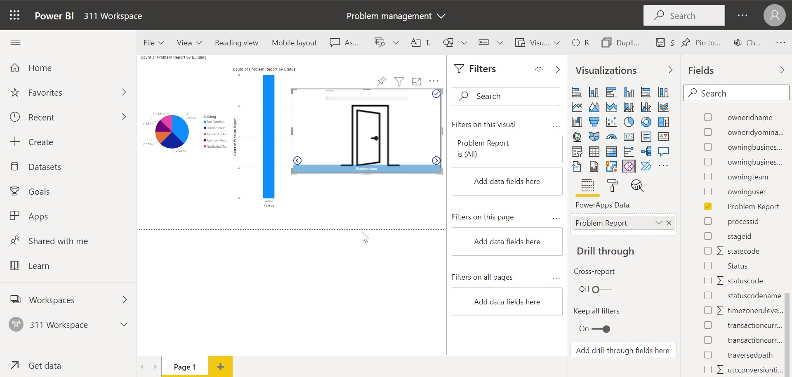

1. Select the **Completed** column of the stacked column chart and make a note how many rows are completed.

1. Select any column of the stacked column chart apart from **Completed**. Click on the next icon to see the next image.

1. Click on the **Complete** icon. 

      

1. The completed count should increase. If the completed count doesn't increase, click refresh and wait for the visuals to be refreshed.

    

1. Click **Save** to save the report..

## Challenges

* Dashboards and reports to include drilldown to individual reports with photos
* Report and analyze problem patterns and trends
* Problem resolution status visualization as a funnel

## Addendum

### Import sample data

In this exercise you will import sample data into Power BI service. That allows you to complete the lab exercises even if do not have required permissions to install desktop applications, or experience difficulties in configuring Power BI Desktop and connecting it to the data. After completion of this exercise you can skip **Exercise1** and start the lab on **Exercise 2** using Power BI service ([https://app.powerbi.com](https://app.powerbi.com)) instead of Power BI Desktop. 

1. Download [problem-reports-data.pbix](06\Resources\problem-reports-data.pbix) and save on your computer.

1. Navigate to [Power BI](https://app.powerbi.com/).

1. Click **311 Workspace**.

1. Expand **+New** and select **Upload a file**.

      

1. Select **Local File**.

1. Locate and select **problem-report-data.pbix** file that you've downloaded earlier.

1. Once data load is complete, select **problem-reports-data** report.

1. Click **...** then select **Edit**.

      

1. You can now start **Exercise 2: Create Power BI Report** of this lab.
