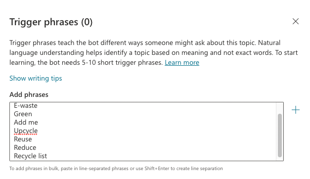
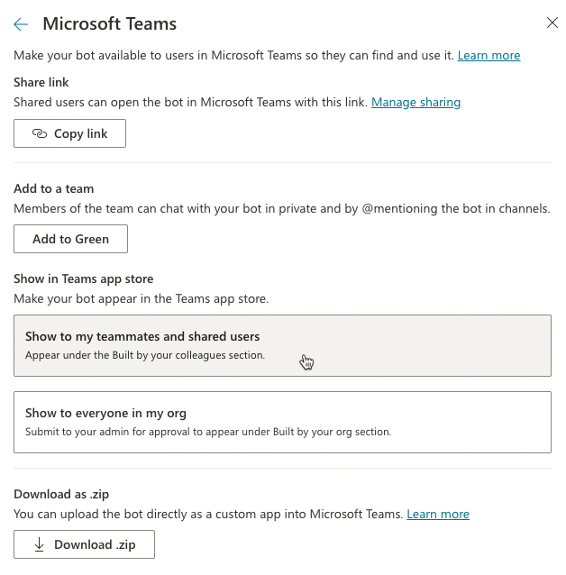
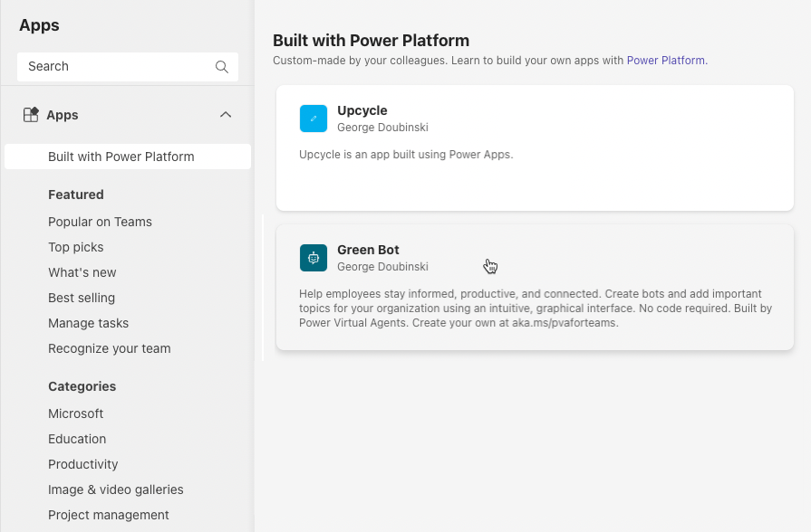

---
lab:
    title: 'Lab 06: Create Power Virtual Agents in Teams'
    module: 'Module 06: AI builder and Power Virtual Agents'
---

> **NOTE**
>
> Effective November 2020:
> - Common Data Service has been renamed to Microsoft Dataverse. [Learn more](https://aka.ms/PAuAppBlog)
> - Some terminology in Microsoft Dataverse has been updated. For example, *entity* is now *table* and *field* is now *column*. [Learn more](https://go.microsoft.com/fwlink/?linkid=2147247)
>

# Lab 06: Power Virtual Agents in Teams

## Scenario

Your organization is trying to recycle E-waste and decided to schedule a quarterly E-waste pickup service. Facilities department created an Excel file in OneDrive for business and want employees to be able to add their name and information about the item they want to get picked up to the list.

In this exercise, you will create a Power Virtual Agents bot that will get the information from users and add them to the pickup list.

## Requirement

 1. Bot should be able to get information about the item.
 2. Bot should be able to get information about the user.
 3. Bot should be able to add the new item to the list.

## What you will learn

 1.	How to create a Power Virtual Agents in Teams.
 2. How to publish Power Virtual Agents.
 3. How to use Power Virtual Agents flow template.

## Detailed steps

### Exercise 1 – Create PVA bot

#### Task 1 - Add Excel file to OneDrive

In this task, you will add an Excel file to your OneDrive for business and add new rows to this file using PVA and Power Automate.

1.  Navigate to [Microsoft Teams](https://teams.microsoft.com).

2.  Select the **App launcher** and select **OneDrive**.

    

3.  Select **Upload** and select **Files**.

    

4.  Browse to the Lab Resources folder, select the **Recycle.xlsx** file, and select Open.

    > **TIP**
	>
	> The lab resources folder can be found here: `F:\Instructions\Labs\06\Resources\`

5.  Open the file you just added.

    

6.  The file should just have headers. **Close** the file and OneDrive browser tabs.

    


#### Task 2 - Install PVA

In this task, you will install PVA.

1.  Navigate to [Microsoft Teams](https://teams.microsoft.com).

2.  Select **...More added apps**, enter **power virtual**, and select **Power Virtual Agents**.

    

3.  Select **Add**. 

4.  Right-click on the **Power Virtual Agents** and select **Pin**. (If the **Power Virtual Agents** menu is not coming on the left menu, then select **... More added apps** and pin it from the recents.)

    

5.  Do not navigate away from this page.


#### Task 3 - Create bot

In this task, you will create the bot.

1.  Select **Power Virtual Agents** and select **Start now**.

    

2.  Select the **Green** team you created and select **Continue**.

3.  Enter **Green Bot** for name, select **English (US)** for language, and then select **Create**.

4.  **Wait** for the bot to be created.

5.  Select **Test your bot** in the bottom left.

6.  Enter **Hello** in the text box and select **Send**. 

7.  The bot should respond with the default greeting. You will edit this greeting in the next task.

    

8.  You can show/hide the bot by clicking on the bot icon located in the bottom left. This will give more room for the authoring canvas.

    

9.  Do not navigate away from this page.


#### Task 4 - Edit greeting

In this task, you will edit the default greeting.

1.  Select **Topics** and open the **Greeting** topic.

    

2.  Take a look and see the trigger phrases for this topic.

3.  On the authoring canvas go to the first **Message** and replace the message with the text below.

    ```Hi! I'm a virtual agent. I can help you recycle e-waste by posting items to the Upcycle application or add them to the quarterly e-waste pickup list.```

    

4.  Select **Save**.

5.  Select **Test your bot** to show the bot.

6.  Enter **Hey** and select **Send**.

7.  The bot should now use your updated message. 

    

8.  Hide the bot.

9.  Do not navigate away from this page.


#### Task 5 - Create topic

In this task, you will create a new topic for the bot so it can respond to inquiries.

1.  Select **Topics** and select **+ New topic**.

    

2.  Select **Details** to open the Details pane.

3.  Enter **Recycle Reuse Reduce** for Name.

4.  Select **Trigger phrases**.

5.  Copy the multi-line text below and paste it into **Add phrases** input box.

    ```
    Recycle
    E-waste
    Green
    Add me
    Upcycle
    Reuse
    Reduce
    Recycle list
    ```

    

6.  Select **+** to add entries for trigger phrases in bulk.

7.  Select the first message, enter **I can help you with that.** And then select the **+ Add node** button.

    

8.  Select **Ask a question**.

    

9.  Enter the text below in the Ask a question textbox.

    ```I can add your item to the Upcycle application or to the e-waste pick-up list. What would you like me to do?```

10. Make sure you have **Multiple choice options** selected for Identity, enter **Add to the Upcycle app** for first option and select **+ New option**.

    

11. Enter **Add to the pick-up list** as another option.

12. You should now have two conditions. Select the **...** Options button of one of the conditions and select **Delete**. We are deleting the conditions because adding item to the pick-up list and adding item to the Upcycle application required similar information.

    

13. Change the second input value in Condition menu to **has value**.

    

14. Select the edit variable icon.

    

15. Change the variable name to **UserOption** and close the variable properties pane.

    

16. Select **+ Add node** and select **Ask a question**.

17. Enter the text below in the Ask a question textbox.

    ```What is the name of the item?```

18. Select the **Identify** dropdown and select **User's entire response**.

    

19. Select the **Edit variable** icon.

    

20. Change the variable Name to **ItemName** and close the variable properties pane.

21. Select **+ Add node** after the question.

22. Select **Ask a question** again.

23. Enter the text below in the Ask a question textbox.

    ```What is the description of this item?```

24. Select the **Identify** dropdown and select **User's entire response** again.

25. Select the **Edit variable** icon again. 

26. Change the variable Name to **Description** and close the variable properties pane.

27. Select **+ Add node** after the question.

28. Select **Ask a question** one more time.

29. Enter the text below in the Ask a question textbox.

    ```What is the location of this item?```

30. Select the **Identify** dropdown and select **User's entire response** again.

31. Select the **Edit variable** icon again.

32. Change the variable Name to **Location** and close the variable properties pane.

33. The three questions should now look like the image below. Select **Save**.

    

34. Do not navigate away from this page.


#### Task 6 - Create flow

In this task, you will create a flow that will add the item to the recycle list or to the Upcycle application depending on the user option.

1.  Go to the last question, select **+ Add node** and select **Call an action**.

    

2.  Select **Create a flow**.

3.  Select **Power Virtual Agents Flow Template**

    

4.  Rename the flow **Add item to app or list** and select **+ Add an input**.

    

5.  Select **Text**.

6.  Enter **User ID** and select **+ Add an input** again.

    

7.  Select **Text**.

8.  Enter **UserOption** and select **+ Add an input** one more time.

9.  Select **Text**.

10. Enter **ItemName** and select **+ Add an input** one more time.

11. Select **Text**.

12. Enter **Description** and select **+ Add an input** one more time.

13. Select **Text**.

14. Enter **Location**.

15. You should now have five inputs.

16. Select **+ Insert a new step** and select **Add an action**.

    

17. Search for initialize and select **Initialize variable**.

    

18. Enter **Response to bot** for Name, select **String** for Type.

19. Select **+ Insert a new step** and select **Add an action**.

    

20. Select **+ Insert a new step** again and select **Add an action**.

21. Search for get user profile and select **Get user profile (V2)**.

    

22. Select the **User (UPN)** field and select **User ID** from the dynamic content pane.

    

23. Select **+ Insert a new step** again and select **Add an action**.

24. Search for condition and select **Condition**.

25. Select the first **Choose a value** field and select **UserOption** from the dynamic content pane.

    

26. Select **is equal to** and enter **Add to the Upcycle app**.

27. Go to the **if no** branch and select **Add an action**.

    

28. Search for add a row and select **Add a row into a table** from Excel Online (Business).

    

29. Select **OneDrive for Business** for Location, **OneDrive** for Document Library, **Recycle.xlsx** for File and **PickupTable** for table.

30. Select the **Name** field and select **Display Name** from the dynamic content pane.

    

31. Select the **Email** field and select **Mail** from the dynamic content pane.

32. Select the **Location** field and select the **Location** dynamic content from the Power Virtual Agents step in the dynamic content pane.

    

33. Select the **Description** field and select **Description**  from the dynamic content pane.

34. The flow step should now look like the image below. Select **Add an action**

    

35. Search for set variable and select **Set variable**.

36. Select **Response to bot** for name, select the Value field and select **ItemName** from the dynamic content pane.

    

37. Add the text below after the ItemName.

    ``` was added to the e-waste pick-up list.```

38. Go to the **If yes** branch and select **Add an action**.

    

39. Search for add new row and select **Add a new row** from Microsoft Dataverse.

    

40. Select **Gadgets** for the table name.

41. Select the Location field and select **Location** from the dynamic content pane.

42. Select the Name field and select **ItemName** from the dynamic content pane.

43. Select **Show advanced options**.

    

44. Select **Available** for Availability, select the Description field and select **Description** from the dynamic content pane.

45. Select **Add an action** after the add a new row step.

46. Search for set variable and select **Set variable**.

47. Select **Response to bot** for Name, select the Value field and select **ItemName** from the dynamic content pane.

48. Add the text below after the ItemName.

    ``` was added to the Upcycle application.```

48. The two branches of the condition should now look like the image below. Expand the **Return value(s) to Power Virtual Agents** step.

    

49. Select **+ Add an output**.

50. Select **Text**.

51. Enter **Response**, select the value field, and select **Response to bot** from the dynamic content pane.

    

52. Select **Save** to save the flow.

53. Select the **<-** back button next to the flow name.

    

54. You should now be back to the bot authoring canvas.

55. Do not navigate away from this page.


#### Task 7 - Call flow 

In this task, you will call the flow as an action from the Power Virtual Agents bot.

1.  Go to the last question, select **+ Add node** and select **Call an action**.

2.  Select the **Add item to app or list** flow you created.

    

3.  Select the **User ID** field and select **bot.UserId**.

    

4.  Select the **UserOption** field and select **UserOption**.

5.  Select the **ItemName** field and select **ItemName**.

6.  Select the **Description** field and select **Description**.

7.  Select the **Location** field and select **Location**.

8.  Select **+ Add node** and select **Show a message**.

    

9.  Select the **Insert variable** icon and select **Response**.

    

10. Select **+ Add node** and select **End with survey**.

11. The end of the bot conversation should look like the image below.

    

12. Select **save** to save your changes and wait for the bot to be saved.

13. Do not navigate away from this page.


### Exercise 2 – Test and publish the bot

#### Task 1 - Test bot

In this task, you will test the bot.

1.  **Show** the bot if it is hidden by selecting Show Bot option on the bottom left side of the screen.

2.  Enter **Recycle** and select **Send**.

3.  The bot should ask you if you want to add the item to the e-waste list or the upcycle application. Select **Add to the Upcycle app**.

    

4.  The bot should ask you to provide name. Enter **Bot charger** and select **Send**.

5.  The bot should ask you the description of the item. Enter **Universal bot charger** and select **Send**.

6.  The bot should ask you the location of the item. Enter **Building 4 Room A-754** and select **Send**.

7.  The bot should tell you the item was added to the Upcycle application and ask you if your question was answered. Select **Yes**.

    

8.  The bot should ask you to rate your experience, give it a rating.

9.  The bot should thank you and ask you if it can help you with anything else. Select **Yes**.

10. Enter **Reuse** and select **Send**.

11. Select **Add to the pick-up list** this time.

12. The bot should ask you to provide name. Enter **Bad bot charger** and select **Send**.

13. The bot should ask you the description of the item. Enter **Bad universal bot charger** and select **Send**.

14. The bot should ask you the location of the item. Enter **Building 4 Room A-754** and select **Send**.

15. The bot should tell you the item was added to the e-waste pick-up list and ask you if your question was answered. Select **Yes**.

    

16. Rate the bot.

17. Select **No, thanks**.

18. The bot should end the conversation.

19. Select **Teams**.

    

20. Select **Green** team chat. Select the **Upcycle** tab.

21. Search for bot. You should see the **Bot charger** the bot added to the application.

    

22. Select the App launcher and select **OneDrive**.

    

23. Open the **Recycle.xlsx** file. 

24. You should see the **Bad universal bot charger** added by the bot.

    

25. Close the **Excel file**.

26. Close **OneDrive**

27. You should now be back on the Upcycle application.

28. Do not navigate away from this page.


#### Task 2 - Publish and add bot

In this task, you will publish the bot you created.

1.  Select **Power Virtual Agents**. 

    

2.  Select the **Chatbots** tab and open the **Green Bot**.

    

3.  Select **Publish**.

    

4.  Select **Publish** again.

5.  Select **Publish** on the Publish latest content pop-up and wait for the publishing to complete.

6.  Expand **Manage** and select **Channels**.

    

7.  Select **Microsoft Teams**.

8.  Select **Availability options**.

9.  Select **Show to my teammates and shared users**.

    

10. Select **Share**.

11. Select **Apps**.

    

12. Select **Built with Power Platform** and select the **Green Bot** you created.

    

13. Select **Add**. 

14. The bot should greet you. You may test the bot again.
