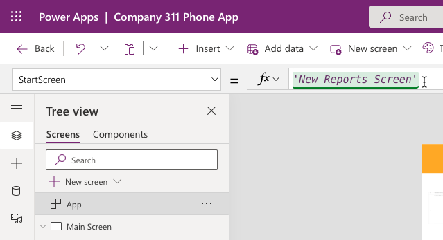
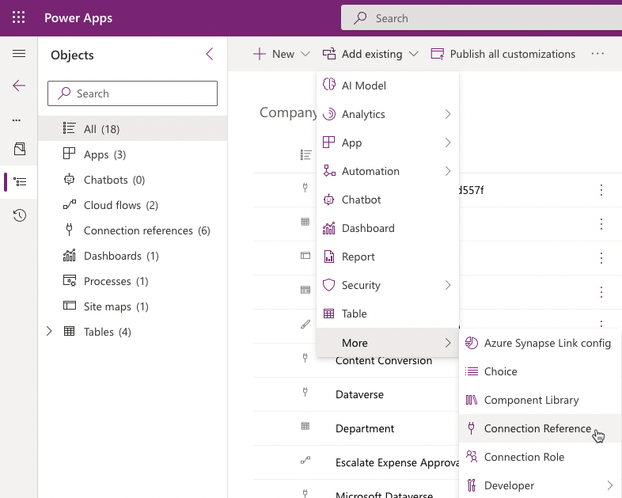
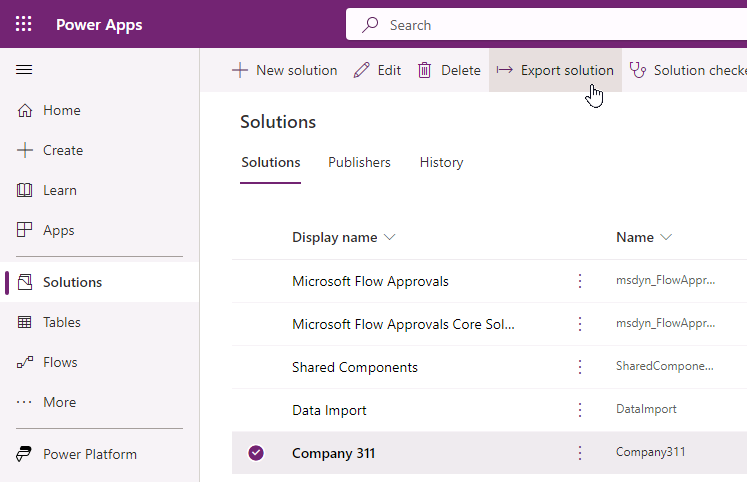
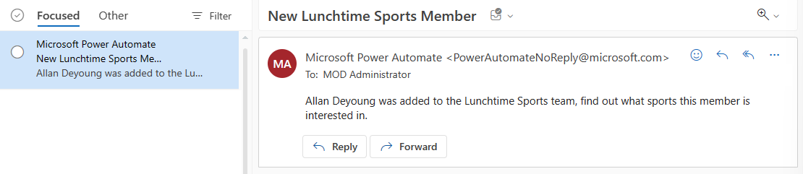

# Lab 07: Test & Deploy

In this lab you will complete solution configuration by adding security roles for the users. Then you will verify, test, and deploy the solution in the production environment.

## What you will learn

  - How to deploy a solution to another environment

## High-level lab steps

  - Exercise 1 – Create security roles for users 
    
      - Company 311 User – read all on Building, user owned on Problem Reports 
      
      - Company 311 Admin – All access for Buildings, Departments, Problem Reports 
      
      - Associate Company 311 Admin role with model-driven app 

  - Exercise 2 – Run solution checker

  - Exercise 3 – Use Test Studio to create test case for submitting problem (ok to not include image)

  - Exercise 4 – Export and import solution
  
  - Exercise 5: Add existing flow to solution

## Prerequisites

* Must have completed **Lab 02.1: Data model and model-driven app**

## Detailed steps

### Exercise 1: Create security roles

In this exercise, you will create security roles for users.

#### Task 1: Create security roles

1.  Navigate to the [Power Apps maker portal](https://make.powerapps.com/) and make sure you are in the correct environment.

1.  Select **Solutions** and click to open the **Company 311** solution.

1.  Click **+ New** and select **Security** and then select **Security Role**.

1.  Enter **Company 311 User** for **Role Name** and select the **Custom Entities** tab.

1.  Set the read privilege of the **Building** Table to **Organization**.

1.  Set the read privilege of the **Problem Report** Table to **User**.

1. The read privileges for the **Building** and **Problem Report** Tables should now look like the image below. Click **Save Create New**.

   

1. Enter **Company 311 Admin** for **Role Name** and select the **Custom Entities** tab

1. Set all privileges of the **Building**, **Department**, and **Problem Reports** Tables to **Organization**.

   

1. Select the **Customizations** tab.

1. Set all privileges for **Model-driven app**.


1. Click **Save and Close**.

1. Click **Done** on the popup.

1. Select **Solutions**.

1. Click **Publish all customizations** and wait for the publishing to complete.

### Exercise 2: Solution checker

In this exercise, you will run the solution checker on the Company 311 solution.

#### Task 1: Run solutions checker

1.  Make sure you are still on the [Power Apps maker portal](https://make.powerapps.com/) site and you are in the correct environment.

1. Select **Solutions**, select **Company 311** solution, click **Solution checker** and select **Run**.

   

1. The solution checker should start checking your solution, wait for it to complete. The solution check column value will change to Results with a timestamp.

1. **Refresh** the page and select the solution again, click **Solution checker**, and select **View results**.


1. Review the solution check results and make sure there are no issues.

   > [!NOTE]
   >
   > If you are seeing errors in the Solution Check Result, open the component showing errors one by one and resolve the issues.
   >
   > At this point you will see errors for Canvas Apps. Open both the apps one by one and fix the assessible label and Tab Index error. For assistance, you can refer to [Microsoft Documentation](https://docs.microsoft.com/en-us/powerapps/maker/canvas-apps/accessibility-checker). After resolving the issues, save and publish your app. Go back to the solution and re-run the solution checker.
   >
   > Users who have vision, hearing, or other impairments can use your canvas app more easily and successfully if you consider accessibility as you design how the app looks and behaves.

### Exercise 3: Use test studio

In this exercise, you use test studio to create test case for submitting a problem report.

#### Task 1: Create test case

1.  Navigate to the [Power Apps maker portal](https://make.powerapps.com/) and make sure you are in the correct environment.

1.  Select **Apps**, select the **Company 311 Phone** application, and click **Edit**. Select **Skip** if prompted.

    

1.  Click **File** and select **Settings**.

1.  Select **Upcoming features**.

1.  Select the **Experimental** tab and enable **Formula level error management**.

1.  Close the settings pane.
    
    Note: Currently test studio cannot record steps inside components like the tab control we are using, you edit the App OnStart formula, so the app navigates directly to the new report screen.

1.  Select the **Tree view** menu.

1.  Select **App** and select **OnStart**.

1.  Add the formula below to the existing formula.

    ```; Navigate('New Reports Screen')```

    

1. Click **File** and select **Save**.

1. Click **Publish**.

1. Select **Publish this version** and wait for the publishing to complete.

1. Click on the **back** button to go back to the app designer.

1. Select the **Advanced tools** tab and select **Open tests**.

    

1. Click on the **ellipsis** of the **Case** and select **Rename**.

1. Rename the Case to **Submit problem report**.

1. Click **Record**.

1. You should see the **New Report** tab.

1. Fill out the form and click **Submit**.

1. Click **Done** button on the bottom-left side of the screen.

1. You should see list of the recorded steps. Click **Play**.

    

1. Click **Publish** and wait for the publishing to complete.

1. The steps should replay correctly. Click **Done**.

1. Close the test studio browser window or tab.

1. Close the app designer browser window or tab.


### Exercise 4: Import export

In this exercise, you will export the company 311 solution and import it into a new environment.

#### Task 1: Export solution

1.  Navigate to the [Power Apps maker portal](https://make.powerapps.com/) and make sure you are in the correct environment.

1.  Select **Solutions**, and click to open the **Company 311** solution.

1.  Click **+ Add existing** and select **More** and then select **Connection Reference**.



1.  Select all of the connection references and click **Add**.

1.  Click **Publish all customizations** and wait for the publishing to complete.

1.  Go back to **Solutions** and select **Company 311** and Click **Export**.



1.  Click **Next**.

1.  Select **Managed** and click **Export**.

1. Save the solution on your computer.

1. Click **Export** again.

1. Click **Next**.

1. Select **Unmanaged**, change the **version** to match the managed solution version and click **Export**.

1. You should have the managed and unmanaged versions of the solution exported.

#### Task 2: Create new environment and import solution

1.  Navigate to [Power Apps Community Plan page](https://powerapps.microsoft.com/en-us/communityplan/)

1.  Click on **Existing User? Add a dev environment**.

1.  Enter your credentials when prompt to sign in

1.  Select your country from the dropdown menu and click **Accept**

1.  Navigate to [Power Platform Admin Center](https://admin.powerplatform.microsoft.com/environments) to see a new environment had been created by the system. We will refer to it as "Prod" environment for the rest of this course (the environment name will be <your account name>'s Environment).

1.  Navigate to the [Power Apps maker portal](https://make.powerapps.com/) and select the environment you just created.

1.  Select **Solutions** and click **Import**.

1.  Click **Choose File**.

1.  Select the managed solution you exported and click **Open**.
    
1.  Click **Next**.

1.  Click **Next** again.

1.  Click **Select connection** for outlook and then click **+ New connection**.


1. It will open a new window. Click **Create**.

1. Provide your **credentials**.

1. Close the connections browser window or tab.

1. Click **Refresh**.

1. Repeat steps 12 - 16 for the rest of the of the connections.

1. Click **Import** and wait for the import to complete.

1. Click **Publish all customizations** and wait for the publishing to complete.

1. Click to open the **Company 311** solution you just imported.

1. Review the components in solution.

1. Select **Apps** and make sure you have both the Canvas and Model-driven applications.

1. Click to open the **Company 311 Admin** application.

1. The application should load without issues.

1. Close the Company 311 Admin application browser window or tab.

1. Click To open the **Company 311 Phone App**.

1. The application should load without issues.

1. Close the **Company 311 Phone App** browser window or tab.


### Exercise 5: Add existing flow to solution

An employee has created a simple personal productivity flow. The flow looks like a very useful addition to everyone at the company so the decision was made to make this flow available to everyone by including it into the existing solution.
In this exercise, you will create the flow outside of the solution and then add it to the Company 311 solution.


#### Task 1: Create the team
In this task, you will create the Lunchtime Sports team.

1.  Navigate to [Microsoft Teams](https://teams.microsoft.com/).

1.  Select **Teams** and click **Join or create a team**.


1.  Click **Create team**.

1.  Select **From scratch**.

1.  Select **Public**.

1.  Enter **Lunchtime Sports** for Team name and click **Create**.

1.  Click **Skip**.

#### Task 2: Create the flow
In this task, you create a flow that will get triggered when someone is added to the group "Lunchtime Sports", the flow will send a notification to you and tell you to find out what sport the new member will be playing.

1.  Navigate to the [Power Apps maker portal](https://make.powerapps.com/) and make sure you are in the correct environment (your practice environment).

1.  Select **Flows**.

1.  Click **+ New flow** and select **Automated cloud flow**.


1.  Click **Skip**.

1.  Search for groups and select **When a group member is added or removed** Office 365.


1.  Click **Sign in**.

1.  Provide your credentials.

1.  Select **Lunchtime Sports** for Group Id and click **+ New step**.

1.  Select **Condition**.

1. Click on the left value field and select **@removed** from the dynamic content pane.

1. Select **is equal to** on the second value field, for third value field select the **Expression** tab, type **null** and click **OK**.

    

1. Go to the **If yes** branch and click **Add an action**.

1. Search for **get user profile** and select **Get user profile (V2)**.

1. Click on the User (UPN) field and select **User Id** from the dynamic content pane.

    

1. Click **Add an action** again.

1. Search for **send** and select **Send me an email notification**.

1. Type **New Lunchtime Sports Member** for Subject.

1. Click on the Body field and select **Display Name** from the dynamic content pane.

1. Type **was added to the Lunchtime Sports team, find out what sports this member is interested in.** after the Display Name.


1. Rename the flow **Notify me when a member is added to the Lunchtime Sports group** and click **Save**.

    


#### Task 3: Test the flow
In this task, you will test the flow.

1.  Navigate to the [Teams](https://teams.microsoft.com/).

1. Click on the **... More options** button of the Lunchtime Sports team and select **Manage team**.

   

1. Click **Add member**.

1. Search and select a guest user you want to use for testing.

1. click **Add**.

1. Click **Close**.

1. Navigate to [Outlook online](https://outlook.office.com/).

1. You should receive the email notification. Open the notification email.

1. The email should look like the image below.

   


#### Task 4: Add flow to solution
In this task, you will add the flow to the Company 311 solution.

1.  Navigate to the [Power Apps maker portal](https://make.powerapps.com/) and make sure you are in the correct environment.

1.  Select **Solutions** and click to open the **Company 311** solutions.

1.  Click **+ Add existing** and select **Cloud flow**.

1. Select the **Outside Dataverse** tab, select the flow you created, and click **Add**.

   

1. Click **Publish all customizations** and wait for the publishing to complete.

1. Click **Export**.

1. Click **Next**.

1. Select **Managed** and click **Export**.

1. Wait for the export to complete and save the exported solution on your machine.

1. Click **Export** again.

1. Click **Next**.

1. Select **Unmanaged**, change the **version** to match the managed solution you just exported and click **Export**.

1. Wait for the export to complete and save the exported solution on your machine.

#### Task 5: Import solution
In this task, you will import the solution into another environment.

1.  Navigate to the [Power Apps maker portal](https://make.powerapps.com/) and select the **Prod** environment that you created in **Exercise 4 Task 2**.

1.  Select **Solutions** and click **Import**.

1.  Click **Browse**.

1.  Select the **managed** version you just exported and click **Open**.

1.  Click **Next**.

1.  You should get a message **This solution package contains an update for a solution that is already installed** click **Import**.


1.  Wait for the solution import to complete.

1. Click to open the **Company 311** solution.

1. Locate the flow you added to the solution and click to open it.


1. Click **Edit**.

    

1. Click to expand the trigger.

1. Click **+ Add new connection**.


1. Click to expand the condition..

1. Click to expand the first step in the **If yes** branch.

1. Click **+ Add new connection** again.

1. Click to expand the last step.

1. Click **+ Add new connection** one more time.

1. Click **Save** and wait for the flow to be saved.

1. Click on the **<-** back button.

1. Click **Turn on**.

1. The flow should show the status as **On**. You can verify the Status value in the Details sections.

